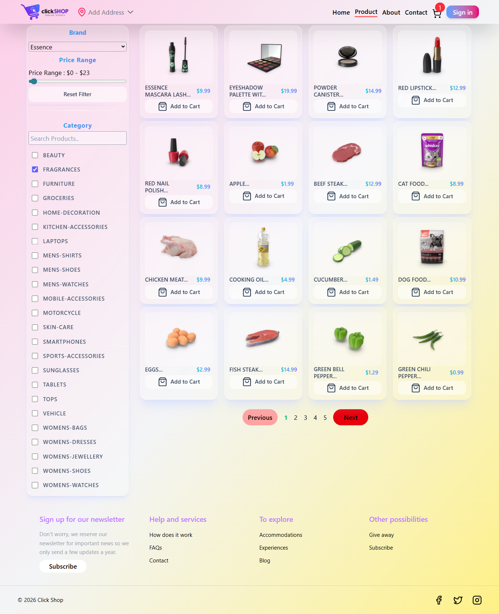

#  Redux Toolkit vs Context Api Projects Guidance

# Table of Contents :

- About
- Features
- Project List
- Installation
- Usage
- Contributing

    -   

# Installation :

Instructions so others can clone and run your projects locally:
- git clone https://github.com/Zeeshanelia/ReduxToolKit-vs-ContextApi-Projects-and-Guidance-Repository
- cd project-folder
- npm i
- npm run dev

# Features or Skills Covered :

List what concepts each project or the repo as a whole covers:

- Context API
- Redux Toolkit
- API Integration
- Performance Optimization & much more...

## Projects List

This repository contains diffrents ReactJs projects about Redux Toolkit vs Context Api.
Each project is linked below for easy access and learning.

## Learning Notes / Lessons

| Day | Project | Concept Learned | Notes / Challenges |
|-----|---------|----------------|------------------|
| 1   | [ E-commerce Context API with  Basic Approach](https://github.com/Zeeshanelia/ReduxToolKit-vs-ContextApi-Projects-and-Guidance-Repository/tree/main/1-%20Ecommerce%20With%20Context%20Api%20%26%20useEffect%2C%20Rest%20Api) | use of Context Api , useEffect  | Learned dynamic e-commerce React app with a global state management, and smooth UI effects using Tailwind CSS and React Context. Gained hands-on experience Project by using Context API with useEffect in a simple approach |

| Day | Project | Concept Learned | Notes / Challenges |
|-----|---------|----------------|------------------|
| 2   | [ Ecommerce Fully Functional With Context API ](https://github.com/Zeeshanelia/ReduxToolKit-vs-ContextApi-Projects-and-Guidance-Repository/tree/main/2-%20Ecommerce%20Fully%20Functional%20With%20Context%20API) | use of Context API , Axios , React Router DOM , Clerk Auth , DummyJSON API , useEffect  | Learned A modern, full-featured e-commerce application built with React, featuring product browsing, category filtering, cart management, and user authentication. |

 - Project 1
 

 - Project 1
 

## Acknowledgements

I would like to express my gratitude to the following resources and mentors who helped me throughout this 100-day ReactJS journey:

- [ReactJS Official Documentation](https://reactjs.org/docs/getting-started.html) – for providing comprehensive guidance on React concepts.
- [Sir Sourav React Tutorials](https://www.youtube.com/@codingott) – for clear and practical project tutorials.
- [Sir Ahsan React Tutorials](https://www.youtube.com/codewithahsan) – for in-depth explanations and coding insights.
- [FreeCodeCamp React Tutorials](https://www.freecodecamp.org/) – for beginner-friendly tutorials and exercises.
- Special thanks to Sir Sourav, Sir Ahsan the ReactJS mentor for their guidance, support, and encouragement.

